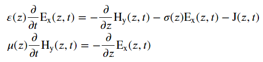

# DGFEM Maxwell Equations

Discontinuous Galerkin finite element method (DGFEM) for Maxwell Equations. Work in progress.
Currenty, the 1D Maxwell equations for a single polarization are implemented:

## Dependencies

- numpy
- numba
- matplotlib

## Biography

Discontinuous Galerkin finite element method (DGFEM): 
- J. S. Hesthaven and T. Warburton, Nodal Discontinuous Galerkin Methods: Algorithms, Analysis, and Applications. Springer, 2008.

Concept of fluxes in connection with the finite-volume method:
- R. LeVeque, Finite Volume Methods for Hyperbolic Problems. Cambridge University Press, 2002.

Low-storage explicit Runge-Kutta (LSERK): 
- J. H. Williamson. Low-storage Runge-Kutta schemes. Journal of Computational Physics, 35:48–56, 1980.
- Lobão, Diomar Cesar. "Low storage explicit Runge-Kutta method". Semina-ciencias Agrarias 40 (2019): 123-128.